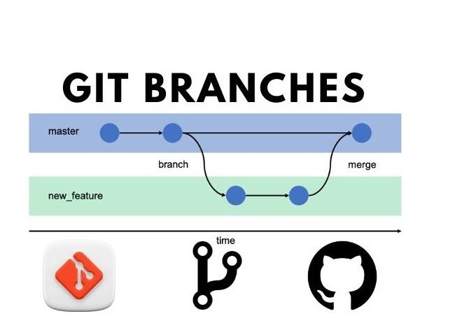

# Git and GitHub Tutorial with VSCode

Welcome to the Git and GitHub Tutorial! This guide is tailored to help you navigate Git and GitHub using Visual Studio Code. By the end of this tutorial, you'll know how to manage your projects, collaborate with others, and leverage GitHub's powerful features—all without leaving your code editor.

## Table of Contents

1. [Introduction to Git and GitHub](#introduction-to-git-and-github)
2. [Setting Up VSCode for GitHub](#setting-up-vscode-for-github)
3. [Git Concepts]()
3. [Creating Repositories](#creating-repositories)
4. [Basic Git Operations in VSCode](#basic-git-operations-in-vscode)
   - [Staging and Committing Changes](#staging-and-committing-changes)
   - [Pushing Changes to GitHub](#pushing-changes-to-github)
   - [Pulling Changes from GitHub](#pulling-changes-from-github)
5. [Working with Branches](#working-with-branches)
6. [Creating Pull Requests on GitHub](#creating-pull-requests-on-github)
7. [Merging Branches and Handling Conflicts](#merging-branches-and-handling-conflicts)
8. [Best Practices for Git and GitHub](#best-practices-for-git-and-github)
9. [Additional Resources](#additional-resources)

---

## Introduction to Git and GitHub

Git is a version control system that allows you to track changes to your code, while GitHub is a platform that hosts your Git repositories online, making it easy to collaborate with others. With VSCode, you can seamlessly integrate Git and GitHub into your development workflow. 

**Using git will eliminate the issue of SB_Latest vs SB_scripts vs Aleks_Scripts**

## Setting Up VSCode for GitHub

1. **Install Git**:
   - Ensure Git is installed on your system. You can install Git using Homebrew on macOS with the following command:
     ```bash
     brew install git
     ```
   - After installation, you can verify that Git is installed by checking the version:
     ```bash
     git --version
     ```

2. **Install VSCode**:
   - Download and install Visual Studio Code from [code.visualstudio.com](https://code.visualstudio.com/).
   - This is definitely installed, but just in case
  
3. **Create a Github Account**:
   - Most of you have a Github account and have been added to our Organization.
   - If you do not have an account and/or have not been added go to [Github.com](https://github.com) and create one then ask me to be added.

4. **Install GitHub Extension**:
   - In VSCode, go to the Extensions view (the icon with four boxes on the left).
   - Search for and install the "GitHub Pull Requests and Issues" extension to manage GitHub repositories and PRs directly from VSCode.

5. **Configure GitHub Authentication**:
   - Open the Command Palette (`Ctrl + Shift + P`) and type `GitHub: Sign In`.
   - Follow the prompts to authenticate VSCode with your GitHub account.

## Git Concepts
* **Repository**
    - essentially the root folder of your code project.
* **Local/Remote**
    - Local means whatever is going on in your particular machine
    - Remote means whatever is going on in Github
* **Branches**
    - The most essential part of git. 
    - Allows for changes to happen in parallel without interfering.

* **Origin**
    - Tied with the concepts of Local and Remote, the origin is wherever you got your repository from, typically the main branch on github.
* **Push**
    - 'Pushing' your changes to another branch, whether that be the remote copy of your branch or the main branch.
* **Pull**
    - 'Pulling' changes from another branch, typically the remote origin.
* **Commits**
    - Commits are checkpoints. They are given a title that should describe the changes made.
    - Commits should be short, and span only a couple of files. This makes it easier to find bugs introduced.
* **Staging**
    - Changes must be staged before committing. This helps us if we didn't commit when we maybe should have. We can stage the changed files we want to include in a given commit, save the commit, then make our second commit.
* **Conflicts and Merges**
    - What happens when two branches make different changes to the same files? We get a conflict
    - VSCode has tools to help! We'll check them out in a few minutes.
* **[Git Concept Cheatsheet](https://medium.com/dwarsoft/git-for-beginners-part-i-basic-git-concepts-a7beb5a136d)**
    - Git can be confusing! Many people give many different explanations. If you find yourself confused, don't worry, you're the millionth person to google clarification on whatever you're trying to figure out. Look at a couple explanations and one of them ought to click!
* **Organizations**
    - groups of people with shared repositories

## Creating and using your own Repositories
1. **Create a New Repository**:
   - Go to GitHub and create a new repository (Green 'New' button in the top left).
   - Give your repository a name, and create it, a public repo will make things easier.

2. **Clone the Repository in VSCode**:
   - Open a new VSCode window.
   - Click on `Clone Git Repository`, paste the repository URL from GitHub, and select a local directory.

### Pushing changes to your own repository
1. **Create a new file**
2. **Add some text for funsies!**
3. **Save your file** 
    - Notice how it shows up green in the file explorer, this means that this file is new to the git repository.
        * Green means new, orange means modified, and red means deleted (or conflicting)
    - Also notice how the source control tab (3 dots) has a blue circle with a '1' in it, this means your git repo has one new change.
4. **Push your changes.**
    - Clicking on the source control tab will show the current state of your local git.
    - Clicking the plus next to your file will stage it for your next commit.
    - Every commit requires a message. If you forget an icky window will pop up and demand a commit_msg.
    - A blue button will appear with a 1 and an arrow pointing up, which will push your changes to the remote origin (your github repo).
5. **View the magic!**
    - Going to your github repo will show your new changes!

### Pulling changes from your own repository
* What if changes happen in the remote branch? Let's try!
1. In Github, make a new file, add some text for fun, then commit your changes. 
    - Github is nice and suggests a commit message, albeit a generic one you usually shouldn't use, fine for this though.
2. In VSCode, go to your repository and click the circle arrow (refresh button) on the top of the source control tab.
3. You'll get a blue button like when you pushed, but instead the arrow will be pointing down.
4. Click the button and watch as you get your brand new file from the remote origin!

## Working within a git repo with multiple people
* Working with multiple people in a git repo requires some more tools, namely branches, you can see the branch you are on in the bottom left of VSCode (Likely main or master right now)
* Much like everything in computers, the more useful something is, the more headaches it's likely to cause. Branches are very... useful.
* When working on a repository that other people have access to, you should always do your work in your own branch.
1. **Clone this repository**
2. **Create a new branch**
    - As mentioned earlier you can view branches in the bottom left of VSCode.
    - Clicking on the indicator in the bottom left will bring up the branch selection menu.
    - Create a new branch from remote/origin.
        * **Always use 'Create New Branch From...'!**
        * In this case 'Create New Branch...' and 'Create New Branch From... (origin/main)' should be the same, however you can get into trouble when you are in a branch other than the main branch. Using Branch From is more explicit and will make sure you're asking for what you want.
    - Name you new branch whatever you like. I'll name mine 'MB-example'
3. **Publish your Branch**
    - Big blue button in source control tab.
4. **Sign your name in the signatures file.**
5. **Commit your change to your branch**
6. **Look for your changes on github**
    - Why isn't there? You're looking at the wrong branch!
7. **Create a pull request**
    - This requests to merge your changes with the changes in the main branch.
    - Convenient popup shows in github, but we'll do it the right way in the pull requests tab.
8. **Uh oh!**
    - What happens if someone makes changes to the original before you make your changes? You get a **conflict**
    - Back to VSCode! (usually easier to deal with this in github but this about learning)
9. **Merge changes from main to your branch**
    - Click on the ellipses in the top of the source control tab, then click 'Merge...' under the 'Branches' section.
    - Merge changes from origin/main
    - Commit and push your merge
    - Fight to get your pull request accepted before someone else does first! If that happens you'll need to merge again!
10. **DELETE YOUR BRANCHES AFTER MERGE**
## **Optional Lesson: Forks**
* Github exclusive concept, not a part of git. Sort of like a branch but for a whole repository between different owners.
    - I love forks, I have so many.

## Best Practices for Git and GitHub

- **Commit Often**: Regularly commit small changes with clear messages.
- **Use Branches**: Keep your `main` branch clean by working on features or fixes in separate branches.
- **Pull Before Pushing**: Always pull the latest changes from the remote repository before pushing your own changes to avoid conflicts.
- **Write Descriptive Pull Requests**: Clearly describe the changes and the context of your PRs to make it easier for reviewers.

## Additional Resources

- [GitHub Docs](https://docs.github.com/en)
- [VSCode GitHub Integration](https://code.visualstudio.com/docs/editor/github)
- [GitHub Learning Lab](https://lab.github.com/)
- [Pro Git Book](https://git-scm.com/book/en/v2)

---

By following this guide, you'll be able to manage your Git projects efficiently and collaborate effectively on GitHub from within VSCode. Happy coding!
